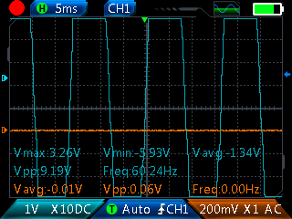
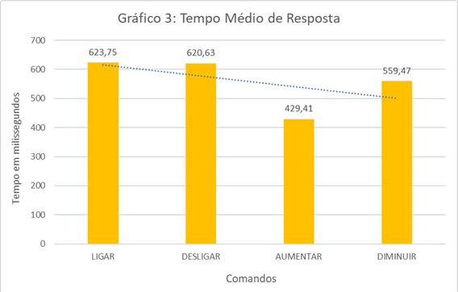

# projeto-tcc-moduladordevoz-eletroterap-a
⚠️ AVISO DE ISENÇÃO DE RESPONSABILIDADE (DISCLAIMER)
Este projeto foi desenvolvido estritamente para fins acadêmicos e de pesquisa como Trabalho de Conclusão de Curso (TCC). Dispositivos de eletroterapia interagem diretamente com o corpo humano e exigem certificações rigorosas de segurança biomédica (como a Anvisa/Inmetro).
O autor não se responsabiliza por danos físicos, materiais ou prejuízos causados pela replicação, modificação ou uso indevido deste circuito/código por terceiros. Use por sua conta e risco.

# Resultados e Análise de Desempenho
O protótipo foi validado funcionalmente com o auxílio de um osciloscópio e passou por testes quantitativos de usabilidade abrangendo 80 tentativas (20 para cada comando essencial).

### Visão Geral do Protótipo
Abaixo está a montagem prática final do circuito integrado, dividida entre a área de controle (5V) e a área de potência (12V) com isolamento óptico:

### Validação do Sinal Elétrico
Com o osciloscópio conectado ao Pino 11 (Gate do MOSFET), confirmou-se a geração estável da onda quadrada de PWM e dos picos de tensão necessários para a estimulação TENS:

### Eficácia do Reconhecimento de Voz (TSPT vs. TFT)
Os testes quantitativos demonstraram que comandos foneticamente mais longos e polissílabos, como "DIMINUIR" (65% de sucesso na primeira tentativa), possuem desempenho significativamente superior a comandos curtos e dissílabos, como "LIGAR" (10% de sucesso):

*   **Taxa de Sucesso na 1ª Tentativa (TSPT) Geral:** 32,1%
*   **Média de Repetições até o Sucesso (MRRS) Geral:** 1,43 repetições
*   **Tempo Médio de Resposta (Latência):** Abaixo de 650ms para todos os comandos, garantindo uma interface de tempo real eficiente.
